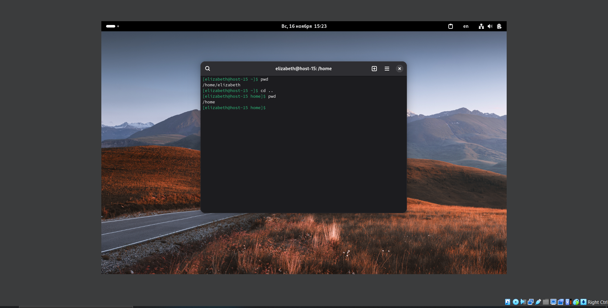
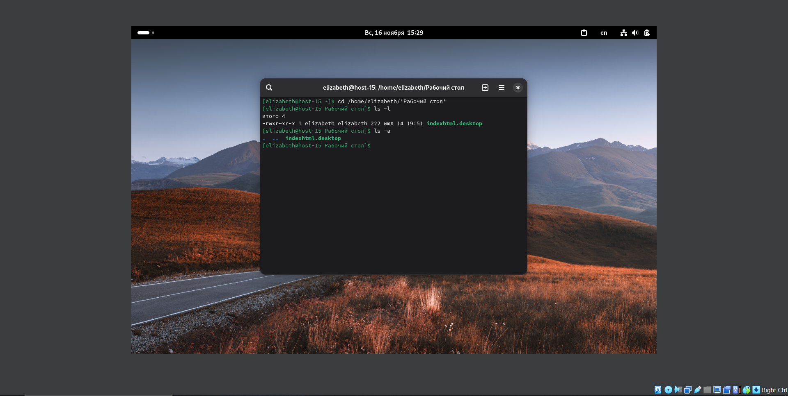
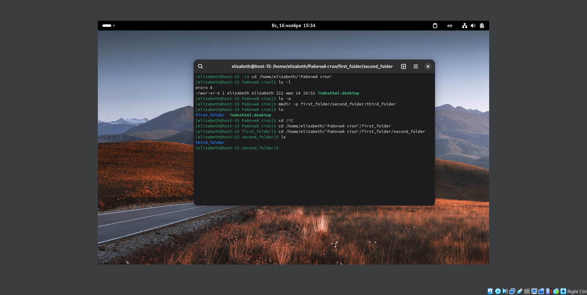
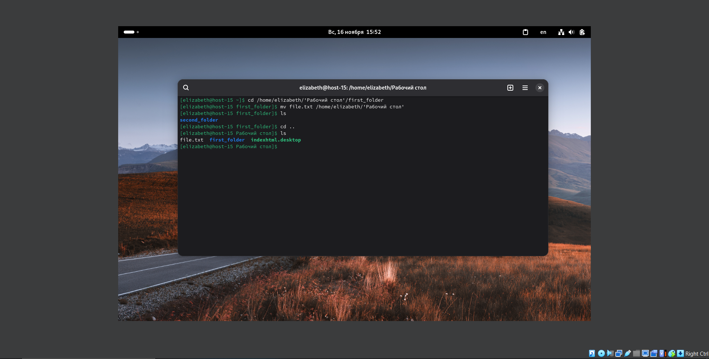
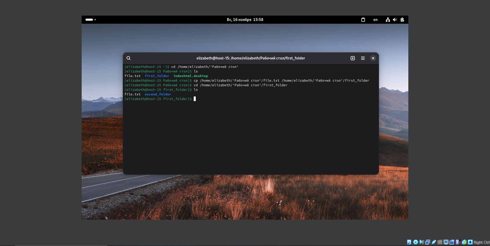
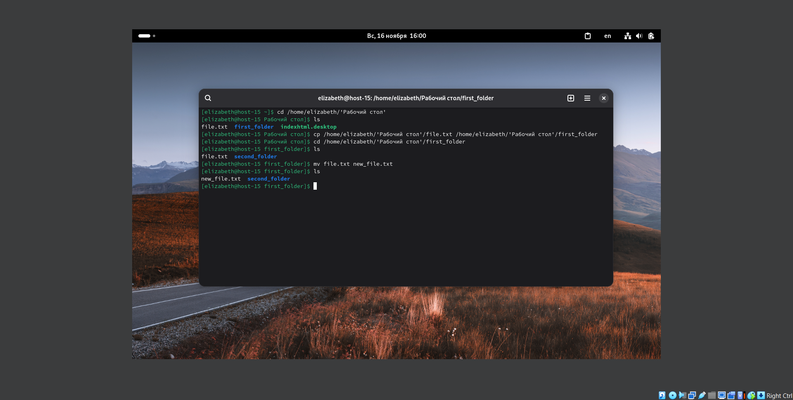
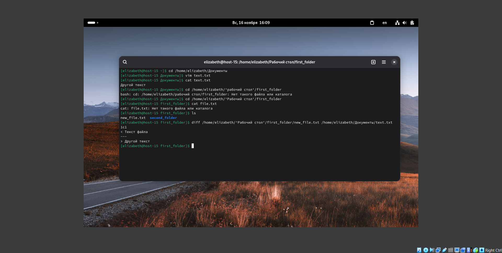
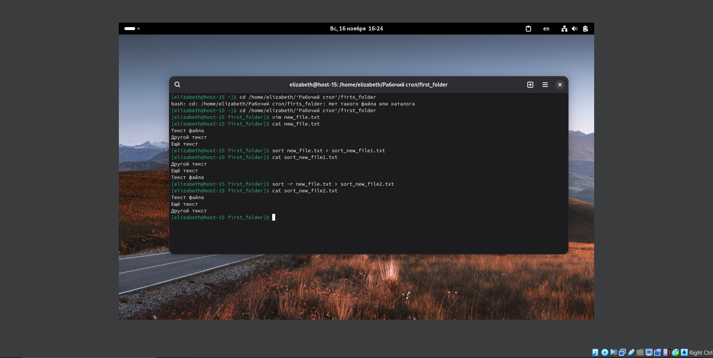
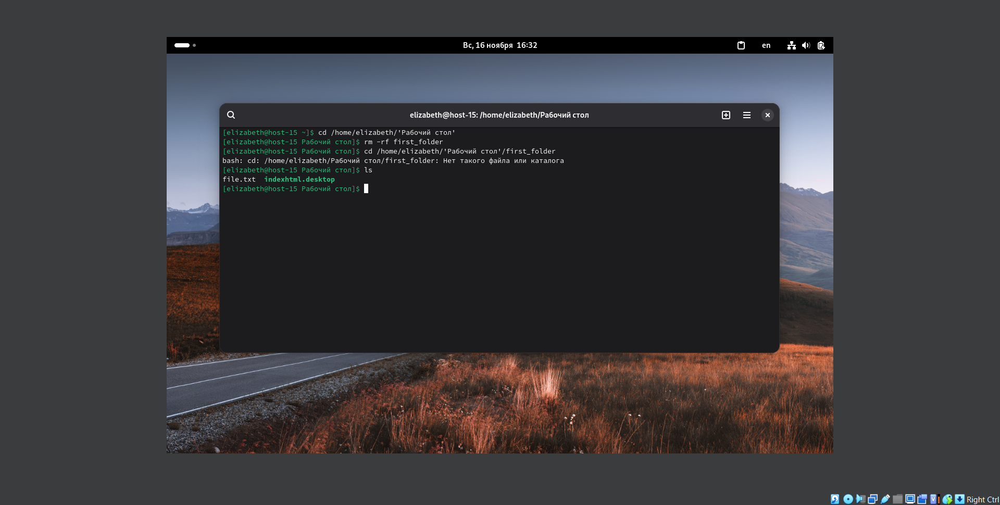

# Лабораторная работа 1 (задание 1)

1. cd .. - переход в предыдущую директорию

2. ls -l - вывод подробного списка файлов с правами, размером и датой

3. ls -a - вывод списка всех файлов (в том числе скрытых)

4. mkdir -p first_folder/second_folder/third_folder - создание промежуточных директорий (папок) в пути с помощью опции -p

5. Создание файлика с текстом внутри папки:
   - Сначала необходимо переместиться в папку, где будет создан файл
   - vim file.txt - создание файла и открытие его через консольный редактор vim:

.png)

   - Нажатие буквы 'i' открывает режим вставки
   - Затем можно напечатать на клавиатуре текст для файла

.png)

   - Чтобы выйти из режима вставки, нужно нажать клавишу Esc
   - Затем нужно написать ':wq' и нажать Enter для сохранения изменений в файле и выхода

.png)
.png)

6. mv file.txt /home/admin/ - перемещение файла из текущей директории на директорию выше

7. cp home/admin/file.txt /home/admin/first_folder - копирование перемещённого файла в папку first_folder

8. mv file.txt new_file.txt - переименование файла file.txt текущей директории в new_file.txt

9. diff first_folder/new_file.txt /home/user/Documents/text.txt - сравнение содержимого файлов new_file.txt и text.txt

10. Сортировка содержимого файла:
   - sort first_folder/new_file.txt > first_folder/sort_new_file1.txt - сортировка содержимого файла по возрастанию и запись отсортированного результата в файл sort_new_file1.txt
   - sort -r first_folder/new_file.txt > first_folder/sort_new_file2.txt - сортировка содержимого файла по убыванию и запись отсортированного результата в файл sort_new_file2.txt

11. rm -rf first_folder - удаление всех папок и файлов в указанной директории
