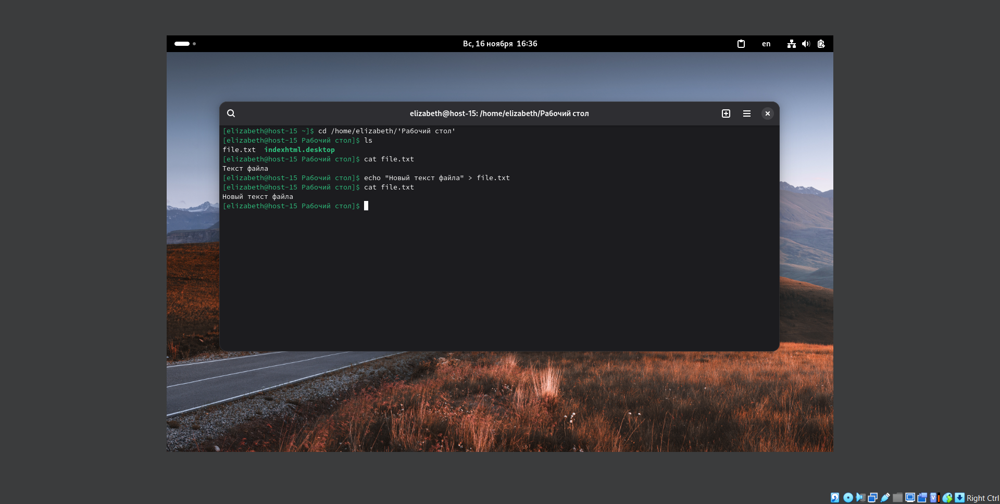

# Лабораторная работа 1 (задание 2)

1. Символы > и >> - это операторы перенаправления вывода в командной оболочке Linux. Они используются для управления тем, куда отправляется результат выполнения команд.
   - оператор > перенаправляет вывод команды в файл, полностью перезаписывая его содержимое, если файл существует. Если файла нет - он создается.
   - оператор >> перенаправляет вывод команды в файл, добавляя его в конец файла, если он существует. Если файла нет - он создается.

2. Перенаправление - это механизм в Linux для управления тем, откуда команды получают входные данные (ввод) и куда отправляют выходные данные (вывод).
   - stdout - стандартный поток вывода, куда программа выводит обычные результаты (терминал/консоль)
   - stderr - стандартный поток ошибок, куда программа выводит сообщения об ошибках (терминал/консоль)

3. cat file.txt - вывод содержимого файла file.txt в терминал

4. echo "текст" > file.txt - команда echo выводит текст в стандартный вывод, а затем перенаправляет этот текст в файл file.txt

5. Перенаправление stdout в stderr и обратно на примере команды kinit, ping, tracert

   - ping - проверяет доступность сетевого узла (сайта, другого компьютера) и качество соединения, отправляя небольшие пакеты данных.
      - ping [опции] целевой_хост 1>&2 - перенаправление stdout в stderr с помощью операции 1>&2
      - ping [опции] целевой_хост 2>&1 - если команда завершится ошибкой, то ошибка будет перенаправлена в stdout с помощью операции 2>&1

   - kinit - это команда для аутентификации в системе Kerberos.
      - kinit имя_пользователя 1>&2 - перенаправление stdout в stderr напрямую с помощью операции 1>&2
      - kinit имя_пользователя 2>&1 - ошибка будет перенаправлена в stdout с помощью операции 2>&1

   - traceroute - показывает путь, который проходят пакеты данных от вашего компьютера к целевому узлу, отображая все промежуточные маршрутизаторы.
      - traceroute [опции] целевой_хост 1>&2 - перенаправление stdout в stderr напрямую
      - traceroute [опции] целевой_хост 2>&1 - перенаправление stderr в stdout напрямую

6. Чем отличаются stdout и stderr?
   - stdout - для нормального вывода программы
   - stderr - для сообщений об ошибках и диагностики

7. stdin - стандартный поток ввода, источник входных данных для программы (клавиатура)

8. Полное перенаправление всего вывода команды в пустоту:
   - command > /dev/null 2>&1:
     - 2>&1 означает перенаправление stderr туда же, куда сейчас идет stdout. 
     - Работа командной строки: выполняется command, и её вывод (stdout) перенаправляется в /dev/null (специальное устройство, "черная дыра" для данных), а с помощью 2>&1 stderr перенаправляется туда же, куда сейчас идет stdout (в /dev/null).
     - В результате весь вывод команды (и нормальный, и ошибки) бесследно исчезает.